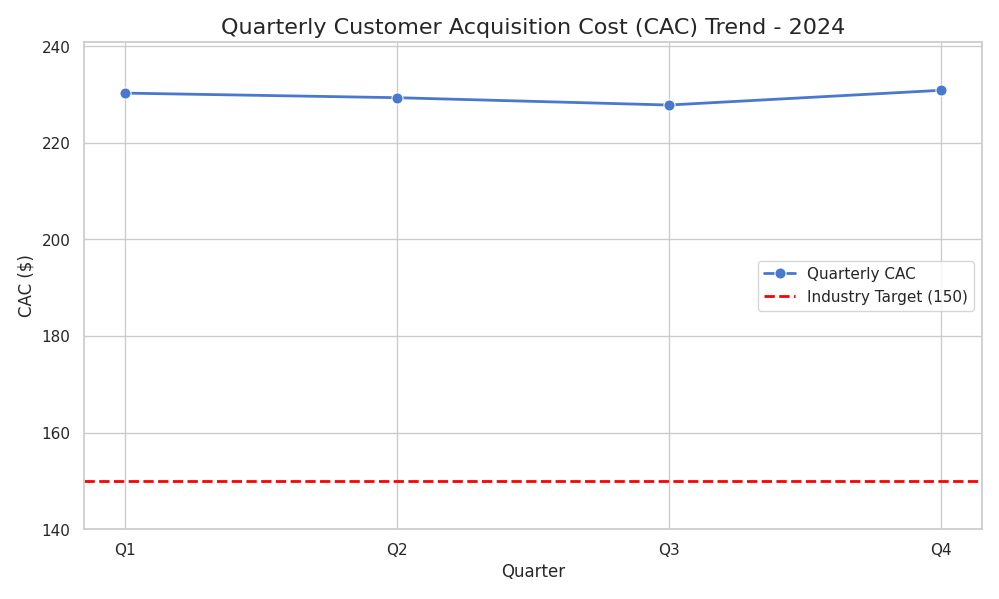

# Customer Acquisition Cost (CAC) Analysis - 2024

**Verification Email:** 24f1002577@ds.study.iitm.ac.in

## Business Context

The company is a financial services firm. Customer Acquisition Cost (CAC) represents the average expense incurred to acquire a new customer. Monitoring CAC is critical for evaluating marketing efficiency and overall profitability.

## Quarterly CAC Data

| Quarter | CAC ($) |
|---------|---------|
| Q1      | 230.3   |
| Q2      | 229.35  |
| Q3      | 227.83  |
| Q4      | 230.88  |

**Average CAC for 2024:** 229.59  

**Industry Benchmark:** 150  

## Key Findings

- The CAC has remained consistently high across all quarters, averaging 229.59, which is **significantly above the industry benchmark of 150**.
- There is minor fluctuation, with the lowest CAC in Q3 (227.83) and the highest in Q4 (230.88).
- The rising CAC trend indicates that customer acquisition is becoming increasingly expensive and may negatively impact profit margins if not addressed.

## Business Implications

- A high CAC compared to the industry benchmark suggests that marketing spend is not optimized.
- The company may face reduced ROI on customer acquisition campaigns, making sustainable growth more challenging.
- Prolonged high CAC can strain marketing budgets and limit investments in other strategic initiatives.

## Recommendations

1. **Optimize Digital Marketing Channels**: Review all digital campaigns to identify high-performing channels and reallocate budget from underperforming ones. Focus on cost-effective channels with high conversion rates.
2. **Refine Customer Targeting**: Use customer segmentation and data analytics to target only high-potential prospects, reducing wasted marketing spend.
3. **Leverage Referral Programs**: Encourage existing customers to refer new clients, which typically incurs lower acquisition costs.
4. **Monitor CAC Metrics Regularly**: Implement quarterly CAC reviews to detect rising trends early and adjust marketing strategies accordingly.
5. **Negotiate Vendor Contracts**: Work with marketing service providers to optimize costs and explore performance-based pricing models.

## Visualization

The following line chart visualizes the quarterly CAC trend and highlights the industry benchmark:

The chart clearly shows that the company’s CAC consistently exceeds the industry target, emphasizing the need for strategic action.

---

By following these recommendations, the company can aim to reduce CAC closer to the industry benchmark, improve marketing efficiency, and enhance overall profitability.

thank you
